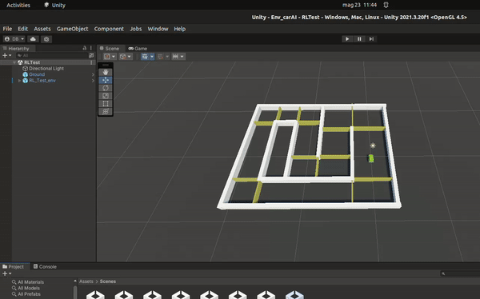
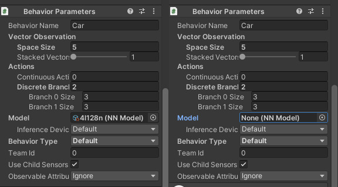
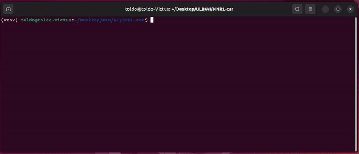

# NNRL-car
This work is a project regarding a self driving car. We wanted to experiment with 3D enviroment and work with something we are passionate about.

This is our first hands on AI algorithms, we have played aroud with Generic Algorithm and DeepRL algorithm.

The Unity project is the folder `Env_carAI`.

# Prerequisites
This project was develop with the Unity version `2021.3.20f1`. 

Since in our scripts we are using the Machine Learning objects, is needed to have installed the `ML Agents` package. This package can be installed via the *Packet manager* of the editor.


Also, for training with DeepRL, we have used the Unity [ml-agents library](https://github.com/Unity-Technologies/ml-agents).


# How to train
# Important notes
Since multiple scenes have multiple agents, modifying one by one would take a long time. It is more reasonable if you modify directly the `prefab`, since that is the reference of every copy in the scene.
You can recognize the prefab for DeepRL as they have the acronym `RL`.
## DeepRL
To train our agent with the DeepRL algorithm, we have used the PPO algorithm that is already implemented into the ml-agents library. 
You can set your hyperparameters, but the one we used is as follows:
```
behaviors:
  Car:
    trainer_type: ppo
    hyperparameters:
      batch_size:   256
      buffer_size:  10240
      learning_rate:    3.0e-4
      beta: 5.0e-4
      epsilon:  0.2
      lambd:    0.99
      num_epoch:    3
      learning_rate_schedule:   linear
    network_settings:
      normalize:    False
      hidden_units: 128
      num_layers:   2
    reward_signals: 
      extrinsic:    
        gamma:  0.99
        strength:   1.0
    keep_checkpoints:   100
    checkpoint_interval:    100000
    max_steps:  5000000
    time_horizon:   64
    summary_freq:   10000
```
If you want to modify the network dimension, you can modify the `hidden_units` and `num_layers`.

The parameters `keep_checkpoints` and `checkpoint_interval` determine the frequency and maximum number of saved Neural Network checkpoints. In this scenario, the Neural Network will be saved every 100.000 steps, and a maximum of 100 checkpoints will be retained, always preserving the 100 most recent ones.

`max_steps` specifies the desired duration of the training in terms of the number of steps. It indicates how many steps you want the training process to proceed before stopping.
On the other hand, `summary_freq` determines the frequency at which you want to print the summary information on the command line interface (cmd). It denotes how often you wish to see updates and relevant information during the training process.

### Start the training
In order to strart the training there are some steps to follow.

- Select the environment. In this case you can select whatever scene start with the acronym `RL`.

- Be sure that there are no Neural Network loaded into the Agent. In order to do so you have to select the `jeep` gaming object, then a panel will show its properties.

- Start the training using the python library command `mlagents−learn path/to/config.yaml −−run−id−name`

- Press the play button on the Unity editor, as this will start the training. The training will automatically stop when the number of steps will reach the one indicated in the config `max_steps`.

## Genetic Algorithm
**----> this was discarded after the first [release](https://github.com/ToldoDM/NNRL-car/releases/tag/v1.0.0-project-submission) <----**
