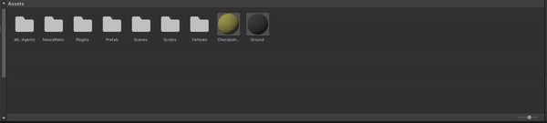

# NNRL-car
This project is a project regarding a self driving car. We wanted to experiment with 3D enviroment and work with something we are passionate about.

This is our first hands on AI algorithms, we have played aroud with Generic Algorithm and DeepRL algorithm.

# Prerequisites
This project was develop with the Unity version `2021.3.20f1`. 

Since in our scripts we are using the Machine Learning objects, is needed to have installed the `ML Agents` package. This package can be installed via the *Packet manager* of the editor.


Also, for training with DeepRL, we have used the Unity [ml-agents library](https://github.com/Unity-Technologies/ml-agents).

The Unity project is the folder `Env_carAI`.


# How to train
**----> Read the important notes at the end <----**
## DeepRL
To train our agent with the DeepRL algorithm, we have used the PPO algorithm that is already implemented into the ml-agents library. 
You can set you hyperparameters, but the one we used is as follows:
```
behaviors:
  Car:
    trainer_type: ppo
    hyperparameters:
      batch_size:   256
      buffer_size:  10240
      learning_rate:    3.0e-4
      beta: 5.0e-4
      epsilon:  0.2
      lambd:    0.99
      num_epoch:    3
      learning_rate_schedule:   linear
    network_settings:
      normalize:    False
      hidden_units: 128
      num_layers:   2
    reward_signals: 
      extrinsic:    
        gamma:  0.99
        strength:   1.0
    keep_checkpoints:   100
    checkpoint_interval:    100000
    max_steps:  5000000
    time_horizon:   64
    summary_freq:   10000
```
If you want to modify the network dimension, you can modify the `hidden_units` and `num_layers`.

The values `keep_checkpoints` and `checkpoint_interval` are regarding how often save the Neural Network that was trained and how many checkpoint to keep at maximum. So in this case it will save the Neural Net evey 100000 steps and keep at maximum 100 Neural Network, always keeping the 100 most recent ones.

`max_steps` and `summary_freq` respectively how many steps do you wanto the training to last and how often do you want the summary printed on the cmd.

### Start the training
In order to strart the training there are 2 steps to do.

- Select the environment. In this case you can select whatever scene start with the acronym `RL`.

- Be sure that there are no Neural Network loaded into the Agent. In order to do so you have to select the `jeep` gaming object, then a panel will show its properties.

- Start the training using the python library command `mlagents−learn path/to/config.yaml −−run−id−name`

- Press the play button on the Unity editor, as this will start the training. The trainin will automatically stop when the number of steps will reache the one indicated in the config `max_steps`.

## Genetic Algorithm
Here to start the training is a little simplier. Here the steps:

- Select the environment. In this case you can select whatever scene start with the acronym `GA`.

- Be sure that there are no Neural Network loaded into the Agent. In order to do so you have to select the `jeep` gaming object, then a panel will show its properties.

- Modify the structure of the Neural Network, if needed.<br>

- Customize the values of the manager. To do so select the `_manager` game object and modify its properties. The property `N Net saving interval` correspond to the frequency of saving the Neural Net after that amount of generations. Here `best agent selection` correspond to the precentage of best performing agents selection. These agents will be kept also for the next generation and will be used to breed the next generation selecting two random parents from the pool.

- Press the play button on the Unity editor, as this will start the training. The training doesn't stop automatically, to stop it is just needed to press the stop button of the editor.

# Important notes
Since multiple scene have multiple agents, modifying one by one would take a long time. Is more reasonable if you modify directly the prefab, since that is the reference of every copy in the scene.
You can recognize the prefab for DeepRL and Genetic algorithm as they have the acronym `GA` and `RL`.
